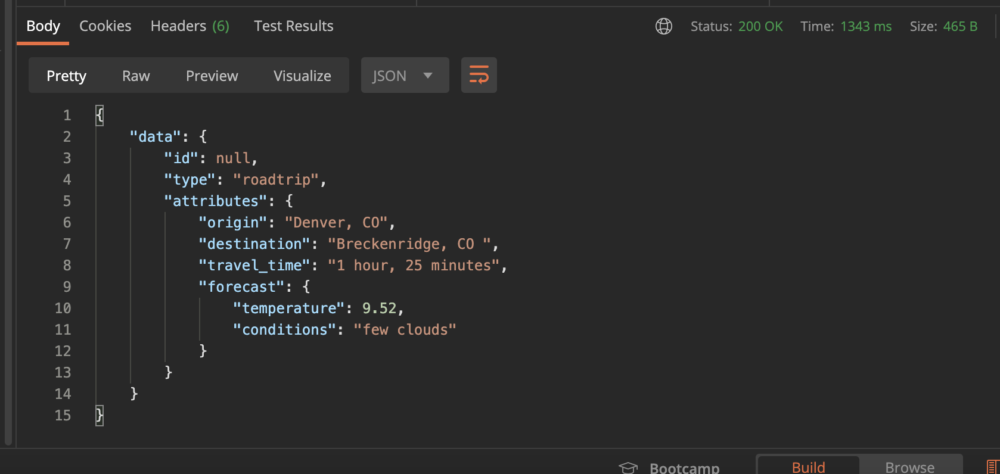

# README

Sweater Weather is a backend rails application built to satisfy wireframes presented by a frontend team working to create a road trip planning weather app.

This application designs endpoints, retrieves a weather forecast for a designated city (current, hourly, & daily), retrieves a background image for a designated city, registers & logs-in a user, and retrieves directions and travel time for a given destination. The formatted responses are in JSON.

## Setup
1. git clone git@github.com:sarynm12/sweater-weather.git
2. cd sweater_weather
3. bundle install
4. rails db{create,migrate}
5. Add your own API keys to the application.yml file (OPEN_WEATHER_API_KEY, UNSPLASH_API_KEY, MAPQUEST_API_KEY)
6. bundle exec rspec to run the test suite

## APIs Utilized
- [Unsplash](https://api.unsplash.com/) 
- [MapQuest](http://www.mapquestapi.com) 
- [Open Weather Map](https://api.openweathermap.org)

## Ruby/Rails Version
Ruby 2.5.3 Rails 5.2.4

## Sample Wireframe

 

## Formatted JSON Response

 

## Testing with RSpec

In the command line run 

`$ bundle exec rspec`

All tests should be passing.
